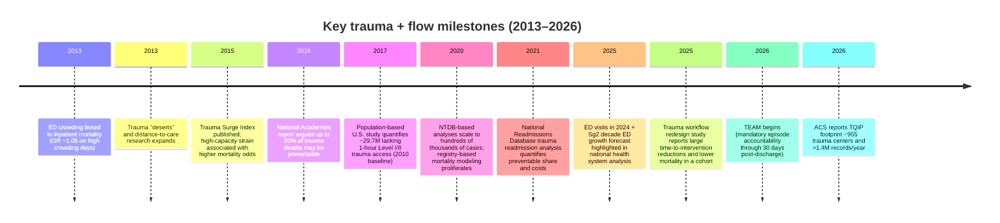

# MedSentinel Impact Evidence Base for Trauma and Hospital Flow

## Executive summary

MedSentinel's core thesis—that many "efficiency" failures in acute care are actually **space-and-time failures** (where people/equipment/patients are, and when handoffs/delays occur)—maps tightly to what national, specialty, and peer‑reviewed sources describe as the dominant constraints in modern hospital operations: rising emergency demand, limited inpatient capacity, uneven trauma access, and avoidable variation in time-critical care delivery.

The U.S. scale is large enough that even small operational shifts can translate into meaningful lives and dollars: **271,729 injury deaths in 2024** (~744/day) and **197,449 unintentional injury deaths in 2024** (~541/day) are recorded in CDC/NCHS vital statistics. Meanwhile, EDs handled **~139.8 million visits in 2024**, and a major forecasting house (Sg2) projects **ED volumes +5% over the next decade** (2025–2035).

For trauma operations specifically, the American College of Surgeons describes a national footprint of **nearly 2,000 trauma centers** and a stark **rural access gap** (only **24%** of rural residents have Level I/II access within one hour vs **95%** of urban residents). This inequity is quantified in a population-based study estimating **29.7 million** U.S. residents lacked 1‑hour Level I/II access (2010 baseline).

On preventability: a high-credibility U.S. policy synthesis by the National Academies of Sciences, Engineering, and Medicine states that **"as many as 20%" of U.S. trauma deaths (2014) may have been preventable with optimal trauma care**—an often-cited, slide-ready upper bound for "inefficiency/variation" in trauma systems. Peer-reviewed panel-review studies show preventability estimates vary widely depending on inclusion rules (prehospital vs in-hospital, "potentially survivable" filters, autopsy availability, and scoring), commonly landing in the **single digits to double digits**, and in some system-level reviews going higher.

Finally, policy tailwinds are explicit: CMS confirms the **mandatory TEAM bundled-payment model** runs **Jan 1, 2026–Dec 31, 2030**, covering five surgical episodes through **30 days post-hospitalization**, making throughput + complications + readmissions financially visible at more hospitals.

---

## National burden and demand signals

### Injury and trauma mortality scale

The CDC and National Center for Health Statistics report **271,729 total injury deaths in 2024** (all intents; includes categories such as poisoning, firearm, motor vehicle traffic, etc.). The same system reports **197,449 unintentional injury deaths in 2024**.

A crucial pitch-deck nuance: these are "injury" totals, not "trauma-center deaths." U.S. death certificates do not flag "trauma center" as a standard national reporting field; national injury mortality is the most defensible top-down proxy for "how big the outcome pie is."

### ED scale and growth pressure

A national hospital performance/forecasting source (Vizient, citing CDC) states Americans made **~139.8 million ED visits in 2024** (42.7 visits per 100 people) and that the **2025 Impact of Change Forecast** by Sg2 projects ED volumes will **grow 5% over the next decade** (2025–2035).

This is a clean "volume up / space fixed" framing: more visits, aging acuity mix, and persistent inpatient bottlenecks, without proportional physical expansion.

---

## Trauma system footprint and access inequity

### How many trauma centers exist

The ACS trauma-systems series reports **nearly 2,000 trauma centers in the U.S.**, with a level breakdown: **213 Level I**, **313 Level II**, **470 Level III**, and **916 Level IV/V**.

This is useful for a "deployment surface area" slide: trauma is not a niche workflow—it is a national distributed network with heterogeneous capabilities.

### Access gaps are concentrated in rural and vulnerable areas

The ACS series also reports that **only 24%** of rural residents have access to a Level I/II trauma center within one hour, compared with **86%** suburban and **95%** urban.

A peer-reviewed U.S. population-based analysis (2010 baseline) found **29.7 million** people lacked access to Level I/II trauma care within 60 minutes and identified disparities by insurance and income: areas with higher uninsured rates were far less likely to have access (reported OR **0.09** for higher uninsured), and rurality strongly reduced access (OR **0.20**).

For "where concentrated" slides, the message is not just rural/urban; it is also **structural vulnerability** (insurance mix, income) correlating with trauma access.

### Trauma registries and the "visibility gap" problem

ACS notes that trauma systems often cannot track patients across the continuum (prehospital → hospital → post-acute), and includes a striking analogy: logistics companies can track packages end-to-end, but the trauma system often cannot track patients comparably. This directly supports MedSentinel's "real-time spatial intelligence" narrative.

Separately, ACS Trauma Quality Programs explicitly warn that their research datasets are broad but **should not be used to make national estimates** because participation is not necessarily nationally representative. This citation is valuable for credibility: the deck can transparently distinguish **national (CDC/NCHS)** from **registry participating-center** statistics.

---

## Preventable harm and failure-to-rescue signals

### "How much is inefficiency?" best-supported U.S. anchor

A frequently cited U.S. policy anchor: the National Academies' news release about *A National Trauma Care System* states that **of 147,790 U.S. trauma deaths in 2014, as many as 20% (~30,000) may have been preventable with optimal trauma care**.

This statistic is pitch-deck friendly because it is (a) U.S.-specific, (b) framed as "systems opportunity," and (c) explicitly an estimate ("as many as"), which you can responsibly present as **a plausible upper bound** on preventable trauma deaths in a given year, not a guaranteed causal attribution.

Source: https://www.nationalacademies.org/news/up-to-20-percent-of-us-trauma-deaths-could-be-prevented-with-better-care

### Study-level preventability rates vary with methodology

Panel-review literature demonstrates a wide spread based on which deaths are reviewed and what is counted as "potentially preventable."

A system-level U.S. county methodology paper (Harris County, Texas; deaths occurring during 2014) reported **1,848 deaths**, **85% autopsy rate**, and a combined preventable/potentially preventable death rate (PPPDR) of **36.2%** using uniform criteria. This is not "national," but it is a concrete example of what a comprehensive death-review system can surface when it includes prehospital + early hospital deaths.

Source: https://pubmed.ncbi.nlm.nih.gov/30067544/

A prehospital-focused study (Australia; full autopsies) illustrates how filtering affects rates: among **113 "potentially survivable" cases** that underwent expert panel review, **17%** were potentially preventable and **3%** preventable (20% combined), which equaled **7% of cases where paramedics attempted resuscitation**.

Source: https://www.injuryjournal.com/article/S0020-1383(19)30100-7/fulltext

These two studies together support a pitch claim that preventability estimates **are not one number**; they depend heavily on data completeness, inclusion criteria, and adjudication rules—precisely the kind of complexity a real-time operational layer aims to reduce by preventing delays before they become deaths.

### Failure-to-rescue quantifies "death after complications," and what portion is preventable

A Level I trauma center panel-review study (2005–2015) quantifies failure-to-rescue (FTR) in trauma as follows: among **26,557** patients, **2,735 (10.5%)** had a complication; **359** of those died (FTR rate **13.2%**). Of FTR deaths, **18.1%** were potentially preventable and **6.1%** preventable by peer review (24.2% combined), while **75.6%** were judged non-preventable.

Source: https://pubmed.ncbi.nlm.nih.gov/27788924/

This is an unusually actionable breakdown for decks because it both (a) quantifies the "complication funnel," and (b) prevents overclaiming: a large share of deaths after complications may not be deemed preventable even on retrospective review. The "MedSentinel" wedge then becomes: shrink the numerator of complications, and shorten the time to detection/response when complications occur.

---

## Flow friction and mortality evidence

### ED crowding/boarding is associated with measurable mortality deltas

A large observational study of ED crowding and admitted-patient outcomes found that on high-crowding days, there was a **5% greater odds of inpatient death** for admitted patients (OR **1.05**, 95% CI 1.02–1.08), along with longer lengths of stay.

Source: https://www.annemergmed.com/article/S0196-0644(12)01699-X/abstract

A quasi-experimental study exploiting the opening of new EDs (South Carolina; seven EDs, 2004–2010 openings) reports that an abrupt **10% decrease in ED patient volume** was associated with **0.28 percentage-point higher 30‑day survival** and **0.45 percentage-point higher 6‑month survival**, corresponding to **24% and 17% reductions** in those respective baseline mortality rates.

Source: https://www.sciencedirect.com/science/article/abs/pii/S0167629618311676

A more recent open-access ED boarding study in an oncologic ED (single specialty population, but strong operational signal) found median boarding time **2.7 hours** (IQR 1.5–5.2) and that boarding **≥5.2 hours** vs **<1.5 hours** had **24% higher odds of in-hospital mortality** (OR **1.24**, 95% CI 1.11–1.38) after adjustment.

Source: https://www.sciencedirect.com/science/article/pii/S268811522500219X

Taken together, these sources support slide-ready effect framing: **crowding relief and boarding reduction are not just "nice for satisfaction"; they correlate with mortality**—with effect sizes that, at national ED scale, can plausibly translate into large absolute numbers.

### Trauma care workflows can yield large time-to-intervention deltas

A 2025 open-access study comparing traditional vs a redesigned in-hospital trauma care model (ISS ≥16; n=366) reports large time improvements in multiple early critical steps:

| Metric | Before | After |
|---|---|---|
| Artificial airway | 36.90 ± 12.23 min | 23.91 ± 9.07 min |
| Whole-body CT completion | 57.18 ± 8.26 min | 42.17 ± 7.28 min |
| Definitive treatment plan | 77.45 ± 6.26 min | 56.50 ± 6.35 min |
| Bedside FAST completion | 53.1% | 92.8% |
| First-hour resuscitation success | 70.9% | 85.0% |
| In-hospital mortality | 12.1% | 5.9% |

Source: https://link.springer.com/article/10.1186/s12873-025-01203-1

Although this study is not U.S.-based, it is powerful for a "time is life" slide because it quantifies, in minutes, the operational gap your product class targets (real-time bottleneck detection and cross-team coordination).

### Capacity strain increases trauma mortality during surges

A multi-center trauma registry analysis developed the Trauma Surge Index (TSI) and found that patients admitted during **high-surge** periods had significantly increased mortality vs low-surge periods (OR **2.05**, 95% CI 1.36–3.10), with firearm-injury patients particularly affected (OR **7.29**, 95% CI 2.13–24.91).

Source: https://pubmed.ncbi.nlm.nih.gov/26232304/

This provides a clean narrative bridge: MedSentinel's real-time spatial + operational awareness is designed to surface capacity strain early—before it converts into mortality risk.

---

## Pitch deck stat pack

### Comparison table of deck-ready statistics

| Stat for pitch deck (slide-ready) | Exact figure | Metric year (source pub year) | Primary / official source | Confidence | Limitations / how to present responsibly |
|---|---:|---|---|---|---|
| Total U.S. injury deaths | 271,729 deaths | 2024 (CDC page current) | https://www.cdc.gov/nchs/fastats/injury.htm | High | "Injury" includes poisoning and violence-related injuries; not limited to trauma-center deaths. |
| U.S. unintentional injury deaths | 197,449 deaths | 2024 (CDC page current) | https://www.cdc.gov/nchs/fastats/accidental-injury.htm | High | Includes events like poisoning and falls; still broader than "major trauma." |
| ED visits, U.S. | ~139.8 million ED visits | 2024 (2025) | https://www.vizientinc.com/insights/all/2025/from-every-angle-emergency-department-overcrowding | Medium | Secondary report citing CDC; use as "CDC-reported in Vizient analysis," or verify via CDC ED dataset if needed for high-stakes claims. |
| ED volume growth forecast | +5% ED volume | 2025–2035 (2025) | https://www.vizientinc.com/insights/all/2025/from-every-angle-emergency-department-overcrowding | Medium | Forecast, not observation; best used to justify urgency and planning horizon. |
| Number of U.S. trauma centers (all levels) | "Nearly 2,000" total; Level I 213, Level II 313, Level III 470, Level IV/V 916 | Not specified (ACS page) | https://www.facs.org/quality-programs/trauma/systems/trauma-series/part-iv/ | Medium-High | ACS summary; trauma center designation also varies by state; present as "ACS-reported national count." |
| Rural Level I/II access within one hour | Rural 24% vs Suburban 86% vs Urban 95% | Not specified (ACS page) | https://www.facs.org/quality-programs/trauma/systems/trauma-series/part-iv/ | Medium-High | Access definition tied to cited references; best for inequity map slide. |
| Population lacking 1‑hour Level I/II access | 29.7 million (of 309 million) | 2010 (2017) | https://pubmed.ncbi.nlm.nih.gov/28069138/ | High | Baseline year is 2010 (older); still widely used; present as "at least tens of millions historically." |
| ACS TQIP participating footprint | 955 trauma centers; >1.4 million records analyzed annually | 2026 status (2026) | https://www.facs.org/for-medical-professionals/news-publications/news-and-articles/bulletin/2026/january-2026-volume-111-issue-1/15-years-of-tqip-excellence-fuels-a-future-driven-by-teamwork/ | Medium-High | Participation-based (not all U.S. trauma centers); still a major operational footprint. |
| NTDB scale + death count proxy in a registry year | 2016 NTDB dataset: 968,665 unique patients; 799,233 complete records with 20,930 deaths | 2016 data (2020) | https://journals.plos.org/plosone/article?id=10.1371/journal.pone.0242166 | Medium | Not a national census; deaths are within "complete-record" subset; use to show deaths in the "tens of thousands" inside registry data. |
| U.S. preventable trauma deaths (policy anchor) | 147,790 U.S. trauma deaths (2014); up to 20% (~30,000) may be preventable | 2014 (2016) | https://www.nationalacademies.org/news/up-to-20-percent-of-us-trauma-deaths-could-be-prevented-with-better-care | Medium-High | "As many as" indicates an estimate; older metric year; best used as upper bound framing. |
| U.S. countywide preventable/potentially preventable death rate | PPPDR 36.2% (1848 deaths; 85% autopsy) | 2014 (2020) | https://pubmed.ncbi.nlm.nih.gov/30067544/ | Medium | Local system study; includes prehospital/early deaths; not generalizable, but useful for "what robust review reveals." |
| Prehospital preventable/potentially preventable deaths (panel-reviewed, filtered) | In reviewed cases: 17% potentially preventable + 3% preventable (20% combined); equals 7% of attempted resuscitations | Not specified (2019) | https://www.injuryjournal.com/article/S0020-1383(19)30100-7/fulltext | Medium | Non-U.S. setting; selection filters strongly shape the percent; use to explain methodology sensitivity. |
| Failure-to-rescue rate in trauma + preventability breakdown | 10.5% had complications; FTR rate 13.2%; among FTR deaths: 18.1% potentially preventable + 6.1% preventable | 2005–2015 (2016) | https://pubmed.ncbi.nlm.nih.gov/27788924/ | Medium-High | Single Level I center; still concrete for "death after complication funnel" and what portion is judged preventable. |
| ED crowding and inpatient mortality | High crowding days: OR 1.05 for inpatient death (≈5% higher odds) | 2003–2008-ish (2013) | https://www.annemergmed.com/article/S0196-0644(12)01699-X/abstract | Medium-High | Observational; crowding measure uses ambulance diversion; still widely cited for harm linkage. |
| Quasi-experimental estimate of crowding relief on mortality | 10% ED volume reduction → +0.28 pp 30-day survival (+0.45 pp at 6 months), ≈24% and 17% mortality reductions vs baseline | 2004–2010 openings (2018) | https://www.sciencedirect.com/science/article/abs/pii/S0167629618311676 | Medium-High | Seven EDs in one state; strong design but limited geography; best as "direction + plausible magnitude." |
| Boarding-time mortality association (adjusted) | Boarding ≥5.2h vs <1.5h: OR 1.24 for in-hospital mortality | 2016–2022 (2025) | https://www.sciencedirect.com/science/article/pii/S268811522500219X | Medium | Oncology population and single system; still a clean "hours → mortality odds" stat. |
| Trauma workflow redesign time savings + mortality delta | Airway 36.90→23.91 min; WBCT 57.18→42.17; plan 77.45→56.50; FAST 53.1%→92.8%; mortality 12.1%→5.9% | 2023 vs 2024 cohorts (2025) | https://link.springer.com/article/10.1186/s12873-025-01203-1 | Medium | China tertiary hospital; demonstrates order-of-magnitude time gains tied to outcomes; avoid claiming U.S. baseline equivalence. |
| Trauma surge capacity strain → mortality odds | High-surge vs low-surge: OR 2.05 mortality; firearm subgroup OR 7.29 | 2010–2011 (2015) | https://pubmed.ncbi.nlm.nih.gov/26232304/ | Medium-High | Strain index method; multi-center; key message is "capacity strain can double mortality odds." |
| Trauma readmissions + preventability + cost | 1,320,083 trauma admissions; 137,854 readmitted within 90d (10.4%); 22.7% potentially preventable; mean cost $10,001 per PPR; $313.8M total | 2017 NRD (2021) | https://pubmed.ncbi.nlm.nih.gov/34252061/ | High | Uses National Readmissions Database; cost is mean and PPR-defined subset, not all readmissions; still strong value-based-care slide. |
| TEAM mandatory model scope | Mandatory; five episodes; 30 days post-hospitalization; runs 2026–2030 | 2026 start (2025) | https://www.cms.gov/priorities/innovation/innovation-models/team-model | High | Applies to selected CBSAs and hospitals; use to show policy "forcing function" for operational analytics. |
| TEAM participation scale | ~741 acute care hospitals in 188 markets; risk for 5 surgical episodes through 30 days post-discharge | 2026 start (ACS page current) | https://www.facs.org/advocacy/team/ | Medium-High | ACS interpretation/summary; use alongside CMS page for official episode definitions & dates. |
| TEAM fact-sheet confirmation of start and episodes | Model begins Jan 1, 2026; includes LEJR, hip/femur fracture, spinal fusion, CABG, major bowel | 2026–2030 (2025) | https://www.cms.gov/files/document/team-model-fs.pdf | High | Official CMS fact sheet; strongest "policy timeline" citation. |

---

## Slide-ready phrasing and speaker notes

**Injury mortality is a "daily loss" scale problem**
- "The U.S. recorded **271,729 injury deaths in 2024**—about **744 deaths/day**."
- "Unintentional injuries alone were **197,449 deaths** in 2024."
- "These are vital-statistics counts—our 'north star' outcome scale."

**ED demand is already enormous—and still growing**
- "**~139.8M ED visits** in 2024; EDs are the front door for the capacity crisis."
- "Sg2 projects **+5% ED volume** over the next decade (2025–2035)."

**Trauma center coverage is broad, but access is uneven**
- "ACS cites **nearly 2,000 trauma centers** (all levels)."
- "Only **24% of rural residents** have Level I/II access within 1 hour vs **95% urban**."
- "A population-based study estimated **29.7M people** lacked 1‑hour Level I/II access (2010 baseline)."

**The participating trauma network is already instrumented—but not in real time**
- "ACS TQIP now includes **955 trauma centers** and **>1.4M records/year**—huge QI footprint."
- "ACS explicitly notes we still can't reliably track patients end-to-end across stages of care."

**Best U.S. 'preventable deaths' anchor for decks**
- "National Academies: **147,790 U.S. trauma deaths in 2014**; **up to 20% (~30,000)** may have been preventable with optimal trauma care."
- "Present as *upper-bound opportunity* (variation + delay), not as a precise causal attribution."

**Failure-to-rescue shows where 'process' meets mortality**
- "In one Level I trauma center review: FTR rate **13.2%** among patients with complications."
- "~**24%** of FTR deaths were judged preventable/potentially preventable."

**ED crowding/boarding has mortality effect sizes, not just 'experience' costs**
- "High crowding days: **~5% higher odds** of inpatient death for admitted patients."
- "A 10% crowding relief event corresponded to **~24% lower 30‑day mortality** in a quasi-experiment."
- "Boarding ≥5.2h vs <1.5h: **OR 1.24** for in-hospital mortality (oncology ED study)."

**Trauma workflow redesign can cut critical minutes and halve mortality in a cohort**
- "Airway **~37 → 24 min**, whole-body CT **~57 → 42 min**, definitive plan **~77 → 57 min**."
- "FAST completion **53% → 93%**; mortality **12.1% → 5.9%** in the study cohorts."

**Readmissions and preventability are already a nine-figure annual tax**
- "NRD 2017: **10.4%** readmitted within 90 days; **22.7%** potentially preventable."
- "Mean cost **$10,001 per potentially preventable readmission**; **$313.8M** total."

**Policy forcing function: TEAM makes the episode an operational scoreboard**
- "TEAM is mandatory, **Jan 1, 2026–Dec 31, 2030**, covering five procedure episodes through **30 days post-hospitalization**."
- "ACS estimates **~741 hospitals in 188 markets** will be required to participate."

---

## Timeline of key milestones

